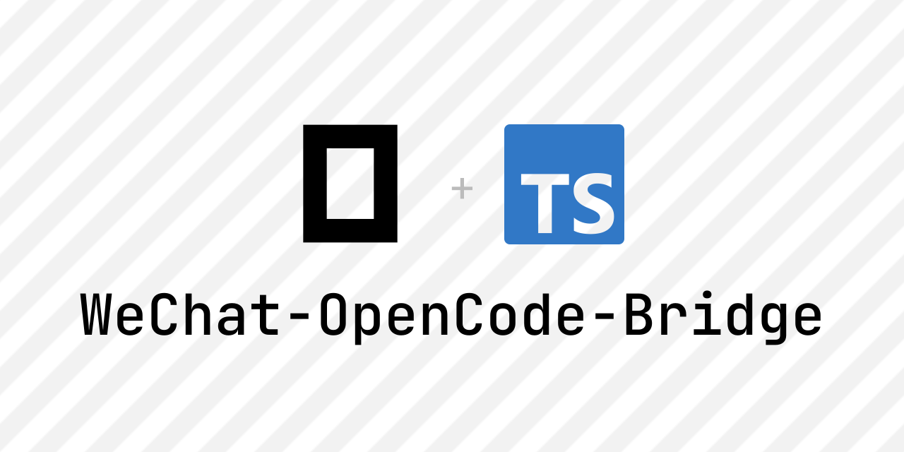
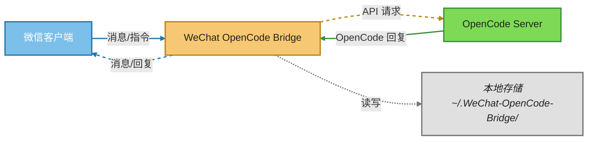
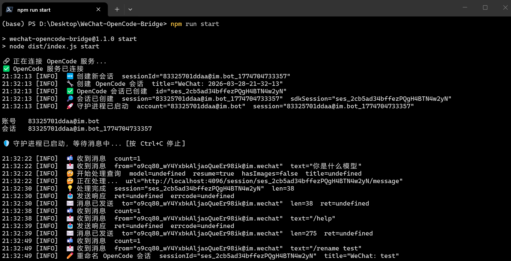
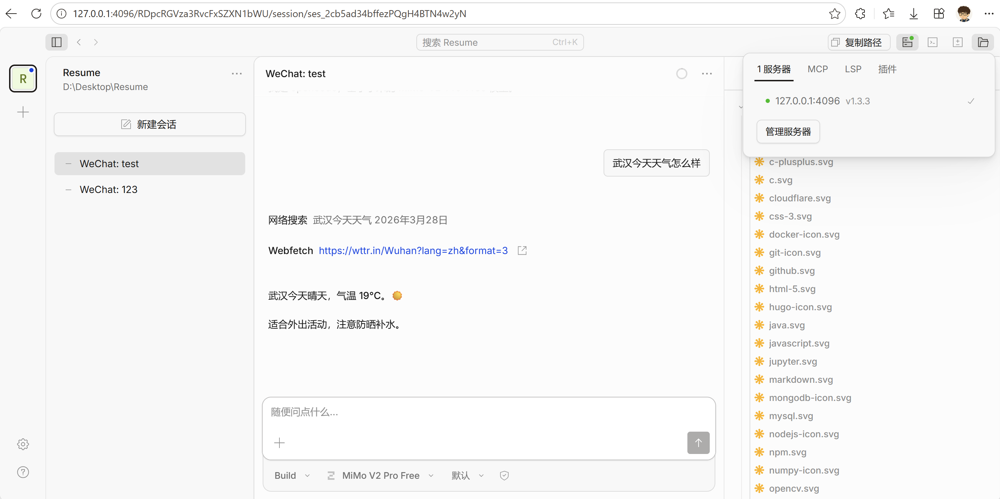
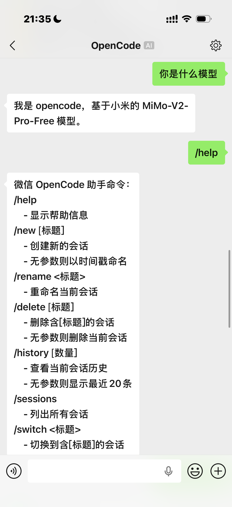
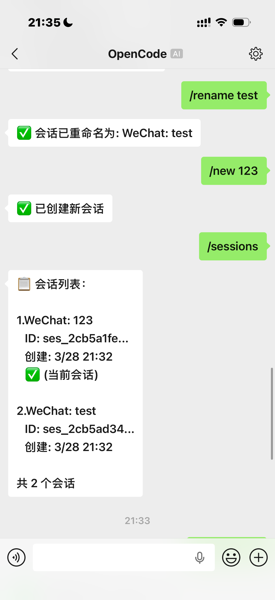
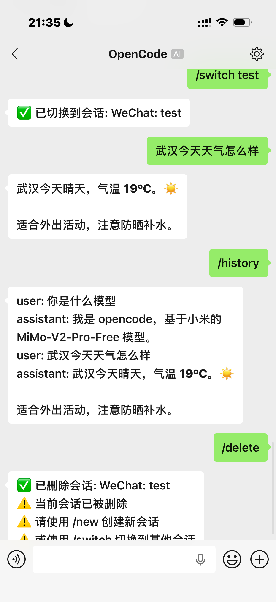

<div align="center">




***将微信个人账号连接到 OpenCode AI 的桥接服务***

</div>

## 📖 简介
WeChat OpenCode Bridge 是一个基于 Node.js 的桥接服务，它能够：
- 🔗 连接微信个人账号与 OpenCode AI
- 💬 通过微信发送消息，AI 自动回复
- 🔄 支持多会话管理，随时切换
- 📱 扫码绑定，简单快捷

## 🏗️ 项目架构
```
WeChat-OpenCode-Bridge/
├── src/
│   ├── index.ts              # CLI 入口（setup、daemon、status 命令）
│   ├── logger.ts             # 结构化日志单例
│   ├── constants.ts          # 共享常量（路径、URL、限制）
│   ├── config.ts             # 配置加载/保存
│   ├── commands/
│   │   └── router.ts         # 斜杠命令路由（/help、/new、/sessions 等）
│   ├── opencode/
│   │   └── client.ts         # OpenCode REST API 客户端
│   ├── store/
│   │   ├── account.ts        # 账号凭证持久化
│   │   └── session.ts        # 会话状态 + 聊天历史持久化
│   └── wechat/
│       ├── types.ts          # WeChat ilink API 类型定义
│       ├── api.ts            # WeChat API 客户端
│       ├── login.ts          # 二维码登录流程
│       ├── fetch-helper.ts   # fetch() 包装器（重试 + 超时）
│       └── monitor.ts        # 长轮询消息监听器
├── dist/                     # 编译输出目录
├── node_modules/             # 依赖包   
├── package.json              # 项目信息和依赖
├── tsconfig.json             # TypeScript 配置
└── AGENTS.md                 # 开发者文档
```



## ✅ 前提条件
| 依赖 | 版本要求 | 说明 |
|------|----------|------|
| [Node.js](https://nodejs.org/) | 24+ | JavaScript 运行需要 |
| [npm](https://www.npmjs.com/) | 11+ | Node.js 包管理器 |
| [OpenCode](https://opencode.ai/) | 无限制 | OpeCode Server |
| [WeChat](https://weixin.qq.com/) | >=8.0.70 | 支持Clawbot的账号 |


## 🚀 使用方法
- ### 1️⃣ 克隆仓库
    ```bash
    git clone https://github.com/Nuyoahwjl/WeChat-OpenCode-Bridge.git
    cd WeChat-OpenCode-Bridge
    ```
- ### 2️⃣ 安装依赖
    ```bash
    npm install
    ```
    > 💡 安装完成后会自动执行 `npm run build` 编译 TypeScript
- ### 3️⃣ 绑定微信（首次使用）
    ```bash
    npm run setup
    ```
    按提示用微信扫描终端中的二维码完成绑定。
    > ⚠️ 首次绑定后，以后不需要再绑定（除非会话过期）
- ### 4️⃣ 启动 OpenCode 服务
    在你的**工作目录**下运行：
    ```bash
    opencode serve
    ```
- ### 5️⃣ 启动桥接服务
    在**仓库目录**下运行：
    ```bash
    npm run start
    ```

## 📋 可用命令
| 命令 | 说明 |
|------|------|
| `npm run setup` | 扫码绑定微信（首次使用） |
| `npm run start` | 启动桥接服务 |
| `npm run dev` | 开发模式（自动重新编译） |
| `npm run build` | 手动编译 TypeScript |
| `npm run status` | 显示当前绑定账号和会话状态 |


## 💡 微信快捷指令
在微信中发送以下指令：
| 指令 | 说明 | 示例 |
|------|------|------|
| `/help` | 显示帮助信息 | `/help` |
| `/new [标题]` | 创建新会话 | `/new 我的项目` |
| `/rename <标题>` | 重命名当前会话 | `/rename 新名字` |
| `/delete [标题]` | 删除会话 | `/delete 项目` 或 `/delete` |
| `/history [数量]` | 查看聊天历史 | `/history 10` |
| `/sessions` | 列出所有会话 | `/sessions` |
| `/switch <标题>` | 切换到指定会话 | `/switch 项目` |

<details>
<summary>指令详细说明（点击展开）</summary>

#### `/help`
显示所有可用指令的帮助信息。

#### `/new [标题]`
创建一个新的 OpenCode 会话。
- 有参数：使用 `WeChat: <标题>` 作为会话名
- 无参数：使用时间戳作为会话名（格式：`WeChat: YYYY-MM-DD-HH-mm-ss`）

#### `/rename <标题>`
重命名当前会话。会话名会自动添加 `WeChat: ` 前缀。

#### `/delete [标题]`
删除指定的会话（同时删除 OpenCode 服务器和本地记录）。
- 有参数：删除标题**包含**该关键词的会话（不区分大小写）
- 无参数：删除当前会话
- ⚠️ 删除当前会话后，请使用 `/new` 创建新会话或 `/switch` 切换到其他会话

#### `/history [数量]`
查看当前会话的聊天历史记录。
- 有参数：显示最近 N 条记录
- 无参数：显示最近 20 条记录

#### `/sessions`
列出 OpenCode 服务器上的所有会话，显示标题、ID、创建时间和当前会话标记。

#### `/switch <标题>`
切换到标题**包含**指定关键词的会话（不区分大小写）。
- 如果本地已有该会话的历史记录，会自动恢复
- 支持模糊匹配，例如 `/switch 项目` 会匹配到 `WeChat: 我的项目`

</details>

## 📁 数据目录
所有数据存储在用户主目录下的 `.WeChat-OpenCode-Bridge/` 文件夹中：
```
~/.WeChat-OpenCode-Bridge/
├── accounts/            # 账号凭证
│   └── xxxxxxx.json     # 微信绑定信息
├── sessions/            # 会话数据
│   └── xxxxxxx_xxx.json # 本地聊天历史
└── logs/                # 日志文件
```
每个会话文件包含：
- `sdkSessionId`：关联的 OpenCode 会话 ID
- `chatHistory`：本地聊天历史记录
- `state`：会话状态（idle/processing）


## 🛠️ 开发相关
### 类型检查
```bash
npx tsc --noEmit
```
### 开发模式
```bash
npm run dev
```
修改代码后会自动重新编译，无需手动运行 `npm run build`。


## 🧩 演示





<div align="center">
    
    
    
</div>

